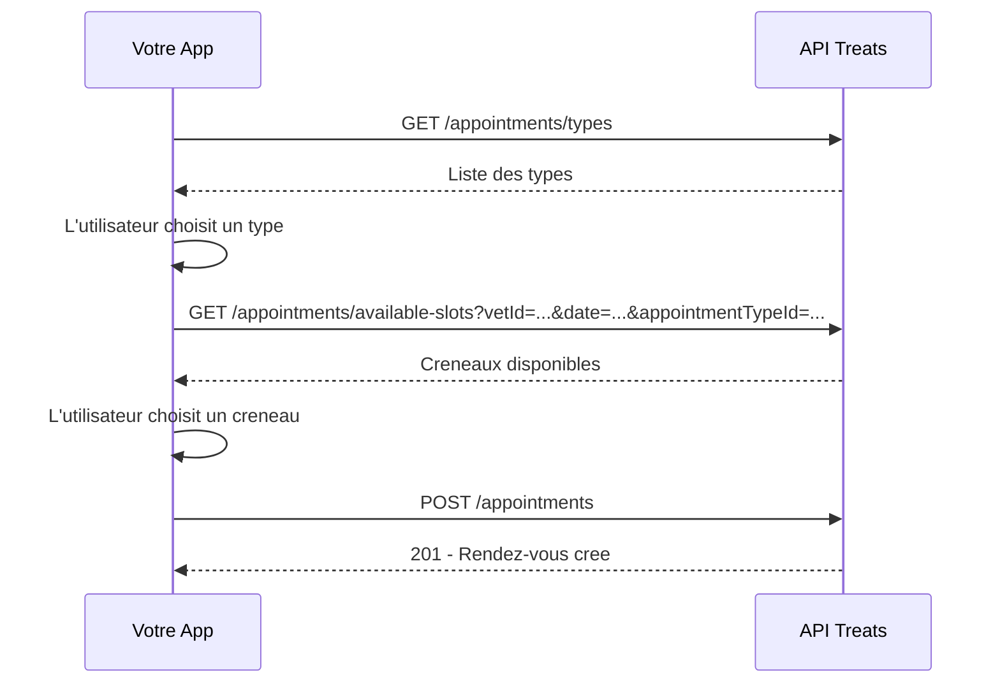

## Objectif

Ce guide montre comment implementer un flux complet de prise de rendez-vous via l'API Treats,
typiquement pour un widget de booking sur un site web ou une application mobile.

**Permissions requises :** `APPOINTMENT_READ` + `APPOINTMENT_CREATE`

## Flux complet



## Etape 1 : Recuperer les types de rendez-vous

```bash
curl -H "X-API-Key: vk_votre_cle" \
  https://api.treats.vet/api/v1/appointments/types
```

```json
[
  {
    "id": "a0eebc99-9c0b-4ef8-bb6d-6bb9bd380a11",
    "name": "Consultation generale",
    "durationMinutes": 30,
    "color": "#4CAF50"
  },
  {
    "id": "b1ffcd00-0d1c-5fg9-cc7e-7cc0ce491b22",
    "name": "Vaccination",
    "durationMinutes": 15,
    "color": "#2196F3"
  }
]
```

## Etape 2 : Consulter les creneaux disponibles

```bash
curl -H "X-API-Key: vk_votre_cle" \
  "https://api.treats.vet/api/v1/appointments/available-slots?vetId=7c9e6679-7425-40de-944b-e07fc1f90ae7&date=2026-02-15&appointmentTypeId=a0eebc99-9c0b-4ef8-bb6d-6bb9bd380a11"
```

```json
[
  {
    "startTime": "2026-02-15T09:00:00Z",
    "endTime": "2026-02-15T09:30:00Z"
  },
  {
    "startTime": "2026-02-15T10:00:00Z",
    "endTime": "2026-02-15T10:30:00Z"
  },
  {
    "startTime": "2026-02-15T14:00:00Z",
    "endTime": "2026-02-15T14:30:00Z"
  }
]
```

## Etape 3 : Creer le rendez-vous

```bash
curl -X POST \
  -H "X-API-Key: vk_votre_cle" \
  -H "Content-Type: application/json" \
  -d '{
    "clientId": "550e8400-e29b-41d4-a716-446655440000",
    "patientId": "6ba7b810-9dad-11d1-80b4-00c04fd430c8",
    "vetId": "7c9e6679-7425-40de-944b-e07fc1f90ae7",
    "appointmentTypeId": "a0eebc99-9c0b-4ef8-bb6d-6bb9bd380a11",
    "scheduledAt": "2026-02-15T10:00:00Z",
    "reason": "Vaccination annuelle"
  }' \
  https://api.treats.vet/api/v1/appointments
```

**Reponse 201 :**
```json
{
  "id": "d4e5f6a7-b8c9-0d1e-2f3a-4b5c6d7e8f9a",
  "clientId": "550e8400-e29b-41d4-a716-446655440000",
  "patientId": "6ba7b810-9dad-11d1-80b4-00c04fd430c8",
  "vetId": "7c9e6679-7425-40de-944b-e07fc1f90ae7",
  "appointmentTypeId": "a0eebc99-9c0b-4ef8-bb6d-6bb9bd380a11",
  "scheduledAt": "2026-02-15T10:00:00Z",
  "endTime": "2026-02-15T10:30:00Z",
  "reason": "Vaccination annuelle",
  "status": "SCHEDULED",
  "isUrgent": false,
  "createdAt": "2026-02-02T10:30:00Z"
}
```

## Gestion des erreurs

### Creneau deja pris (409)

Si un autre rendez-vous a ete pris entre-temps sur le meme creneau :

```json
{
  "message": "Time slot conflict"
}
```

**Solution :** rechargez les creneaux disponibles et proposez un autre choix.

### Patient ou client introuvable (404)

Verifiez que les IDs `clientId` et `patientId` existent dans la clinique.

<Tip>
  Pour une meilleure UX, chargez les creneaux **apres** que l'utilisateur a choisi
  le type de rendez-vous et le veterinaire, pour eviter d'afficher des creneaux obsoletes.
</Tip>
